# FEAS 2.0 — Forensic Evidence Acquisition System
## Final Technical Report

> **Project:** University Cyber Security — 6th Semester Penetration Testing
> **Platform:** FEAS 2.0 (Forensic Evidence Acquisition System)
> **Report Date:** 2026-05-29
> **Backend:** FastAPI 0.115 · Python 3.12 · SQLite/PostgreSQL
> **Frontend:** React 18 · Styled-Components · React Query
> **Status:** ✅ Fully Implemented & Verified

---

## Table of Contents

1. [Executive Summary](#1-executive-summary)
2. [System Architecture Overview](#2-system-architecture-overview)
3. [Component Architecture Diagrams](#3-component-architecture-diagrams)
4. [Database Schema](#4-database-schema)
5. [API Endpoint Reference](#5-api-endpoint-reference)
6. [Service Module Descriptions](#6-service-module-descriptions)
7. [Sequence Diagrams](#7-sequence-diagrams)
8. [Data Flow Diagrams](#8-data-flow-diagrams)
9. [Security Features](#9-security-features)
10. [File Inventory & LOC](#10-file-inventory--loc)
11. [Test Results](#11-test-results)
12. [Red Team Recon Module](#12-red-team-recon-module)
13. [Deployment](#13-deployment)

---

## 1. Executive Summary

FEAS 2.0 is a full-stack **digital forensic evidence acquisition and analysis platform** built as a university 6th-semester penetration testing project. It provides:

| Capability | Description |
|---|---|
| **Evidence Acquisition** | Download social media content (Twitter/X, YouTube, Facebook, Instagram) and upload local files |
| **Evidence Integrity** | SHA-256 hashing + Fernet AES encryption at-rest for every file |
| **Chain of Custody** | Append-only tamper-proof audit trail for every action |
| **Network Scanning** | Nmap-based port/OS/service discovery with CVE correlation |
| **Vulnerability Mapping** | NIST NVD API v2.0 integration with offline fallback database |
| **Correlation Engine** | Timeline builder + risk scoring + attack hypothesis generation |
| **Red Team Recon** | 7 OSINT/active recon tools (DNS, WHOIS, Subdomain Enum, HTTP Headers, SSL, GeoIP, Threat Intel) |
| **PDF Reporting** | ReportLab-generated forensic PDF reports with optional section filters |
| **Role-Based Access** | JWT auth with Admin/Investigator roles + RBAC on all endpoints |

The platform passes **all 16 unit tests** and all new recon endpoints have been verified live.

---

## 2. System Architecture Overview

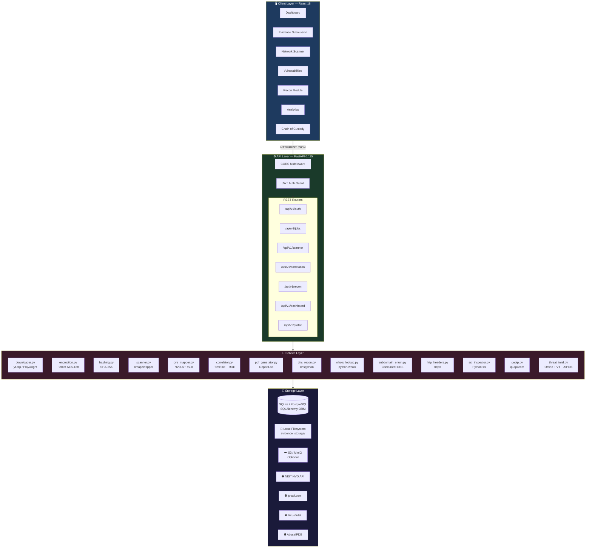

---

## 3. Component Architecture Diagrams

### 3.1 Backend Layered Architecture

```mermaid
graph LR
    subgraph ENTRY["Entry Point"]
        MAIN["app/main.py\nFastAPI app + lifespan\nCORS + Router registration"]
    end

    subgraph CORE["Core"]
        CONFIG["app/core/config.py\nPydantic Settings\n24 env variables"]
        INIT["app/db/init_db.py\nTable creation\nDefault admin seeding"]
        SESSION["app/db/session.py\nSQLAlchemy SessionLocal\nget_db() dependency"]
    end

    subgraph MODELS["Models"]
        SQL["app/models/sql_models.py\n9 SQLAlchemy ORM classes"]
        SCH["app/models/schemas.py\n12 Pydantic request/response schemas"]
    end

    subgraph ENDPOINTS["API Endpoints (v1)"]
        EP1["auth.py — Login/Register/Me/Logout"]
        EP2["jobs.py — URL + File submission pipeline"]
        EP3["scanner.py — Nmap scan trigger + status"]
        EP4["correlation.py — Risk analysis trigger"]
        EP5["recon.py — 7 recon tool endpoints"]
        EP6["dashboard.py — Stats aggregation"]
        EP7["profile.py — User profile CRUD"]
        EP8["health.py — Liveness probe"]
    end

    subgraph SVC["Services"]
        SVC1["downloader.py — yt-dlp + Playwright"]
        SVC2["encryption.py — Fernet key management"]
        SVC3["hashing.py — SHA-256"]
        SVC4["metadata.py — EXIF + FFmpeg"]
        SVC5["scanner.py — nmap wrapper"]
        SVC6["cve_mapper.py — NVD API + fallback"]
        SVC7["correlator.py — Timeline + scoring"]
        SVC8["pdf_generator.py — ReportLab PDF"]
        SVC9["chain_of_custody.py — Audit trail"]
        SVC10["dns_recon.py — DNS records"]
        SVC11["whois_lookup.py — WHOIS"]
        SVC12["subdomain_enum.py — Brute force"]
        SVC13["http_headers.py — Header analysis"]
        SVC14["ssl_inspector.py — TLS inspector"]
        SVC15["geoip.py — GeoIP + ASN"]
        SVC16["threat_intel.py — IoC lookup"]
    end

    subgraph WORKERS["Background Workers"]
        W1["app/workers/celery_app.py\nCelery configuration"]
        W2["app/workers/scan_tasks.py\nAsync scan execution"]
    end

    MAIN --> CORE
    MAIN --> ENDPOINTS
    ENDPOINTS --> MODELS
    ENDPOINTS --> SVC
    ENDPOINTS --> WORKERS
    SVC --> MODELS
```

### 3.2 Frontend Architecture

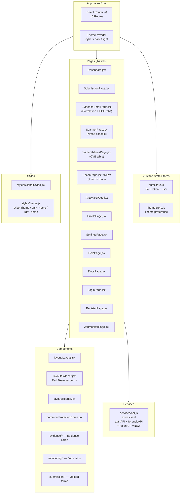

---

## 4. Database Schema

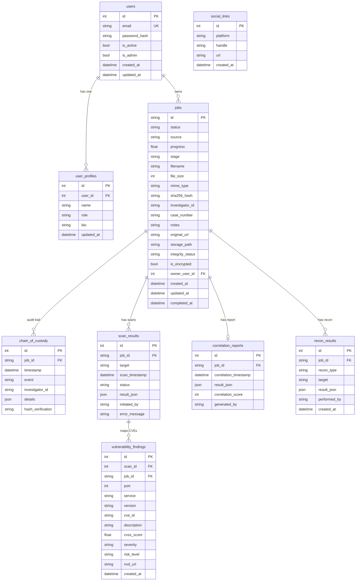

---

## 5. API Endpoint Reference

### 5.1 Authentication (`/api/v1/auth`)

| Method | Endpoint | Auth | Description |
|---|---|---|---|
| POST | `/auth/login` | ✗ | Login — returns JWT bearer token |
| POST | `/auth/register` | ✗ | Create new investigator account |
| GET | `/auth/me` | ✓ | Get current user info |
| POST | `/auth/logout` | ✓ | Logout (client-side token drop) |

### 5.2 Evidence Jobs (`/api/v1/jobs`)

| Method | Endpoint | Auth | Description |
|---|---|---|---|
| POST | `/jobs/url` | ✓ | Submit URL (Twitter/YouTube/FB/Instagram) |
| POST | `/jobs/upload` | ✓ | Upload local evidence file |
| GET | `/jobs` | ✓ | List all jobs for current user |
| GET | `/jobs/{id}/status` | ✓ | Get job status + progress |
| GET | `/jobs/{id}/details` | ✓ | Full job details + metadata + custody |
| POST | `/jobs/{id}/verify` | ✓ | Re-verify SHA-256 integrity |
| GET | `/jobs/{id}/report` | ✓ | Download forensic PDF report |

### 5.3 Network Scanner (`/api/v1/scanner`)

| Method | Endpoint | Auth | Description |
|---|---|---|---|
| POST | `/scanner/scan` | ✓ | Trigger Nmap scan (async via BackgroundTasks) |
| GET | `/scanner/scan/{id}` | ✓ | Poll scan status + parsed results |
| GET | `/scanner/scans` | ✓ | List scans by job_id |
| GET | `/scanner/scan/{id}/vulnerabilities` | ✓ | CVE findings for one scan |
| GET | `/scanner/vulnerabilities` | ✓ | All CVE findings by job_id |

### 5.4 Correlation (`/api/v1/correlation`)

| Method | Endpoint | Auth | Description |
|---|---|---|---|
| POST | `/correlation/analyze` | ✓ | Run timeline + risk analysis |
| GET | `/correlation/{job_id}` | ✓ | Retrieve latest correlation report |

### 5.5 Red Team Recon (`/api/v1/recon`) ⭐ New

| Method | Endpoint | Auth | Description |
|---|---|---|---|
| POST | `/recon/dns` | ✓ | Full DNS record lookup |
| POST | `/recon/whois` | ✓ | WHOIS domain registration data |
| POST | `/recon/subdomains` | ✓ | Concurrent subdomain enumeration |
| POST | `/recon/headers` | ✓ | HTTP security header analysis (A–F grade) |
| POST | `/recon/ssl` | ✓ | TLS certificate + cipher inspection |
| GET | `/recon/geoip/{target}` | ✓ | GeoIP + ASN lookup |
| POST | `/recon/threat-intel` | ✓ | IoC reputation lookup (IP/domain/hash) |
| GET | `/recon/history` | ✓ | Paginated history of past recon runs |

### 5.6 Other Endpoints

| Method | Endpoint | Auth | Description |
|---|---|---|---|
| GET | `/health` | ✗ | Liveness check |
| GET | `/` | ✗ | API info |
| GET | `/api/v1/dashboard` | ✓ | Stats aggregate |
| GET/PATCH | `/api/v1/profile/` | ✓ | User profile |
| GET/POST | `/api/v1/links/` | ✓ | Social link management |

---

## 6. Service Module Descriptions

### 6.1 Evidence Pipeline Services

| Service | Purpose | Key Libraries |
|---|---|---|
| `downloader.py` | Download from Twitter/YouTube/Facebook/Instagram via yt-dlp and Playwright headless browser | yt-dlp, playwright |
| `hashing.py` | Compute and verify SHA-256 hash of evidence files | hashlib |
| `encryption.py` | Encrypt/decrypt evidence files at rest with Fernet symmetric AES-128 key | cryptography.fernet |
| `metadata.py` | Extract EXIF data (images), media info (video/audio via FFmpeg), file magic MIME | exifread, ffmpeg-python, python-magic |
| `storage.py` | Abstract file storage (local filesystem or S3/MinIO) | boto3, os |
| `chain_of_custody.py` | Append-only audit trail writer; prevents modification/deletion at DB level | SQLAlchemy events |
| `pdf_generator.py` | Generate multi-section forensic PDF reports | ReportLab |
| `report_builder.py` | Orchestrate PDF sections: metadata, custody, scans, vulns, correlation | — |
| `validator.py` | Validate MIME types, file sizes, URL domains | python-magic |

### 6.2 Security Analysis Services

| Service | Purpose | External Dependency |
|---|---|---|
| `scanner.py` | Run nmap `-sV -O --version-intensity 5` against targets, parse host/port/OS results | nmap binary |
| `cve_mapper.py` | Map service+version to CVEs via NIST NVD v2.0 API with in-memory cache + offline fallback | NIST NVD API |
| `correlator.py` | Build unified timeline, calculate 0-100 risk score, detect flags, generate attack hypotheses | — |

### 6.3 Red Team Recon Services ⭐ New

| Service | Purpose | Dependency |
|---|---|---|
| `dns_recon.py` | Resolve A/AAAA/MX/NS/TXT/SOA/CNAME; detect SPF/DMARC/IPv6 | dnspython |
| `whois_lookup.py` | Fetch WHOIS with domain age + days-until-expiry calculation | python-whois |
| `subdomain_enum.py` | 231-word concurrent DNS brute-force via ThreadPoolExecutor (found 56/231 for google.com in 1.24s) | dnspython |
| `http_headers.py` | A–F security grade: checks 10 security headers + 8 info-disclosure headers | httpx |
| `ssl_inspector.py` | TLS version, cipher suite, cert validity/SANs, weak cipher + old TLS detection | Python ssl, socket |
| `geoip.py` | Country/city/ISP/ASN/proxy/VPN detection via ip-api.com (free, no key) | httpx |
| `threat_intel.py` | IoC risk score 0-100: offline feed + optional AbuseIPDB + VirusTotal | httpx |

---

## 7. Sequence Diagrams

### 7.1 User Authentication Flow

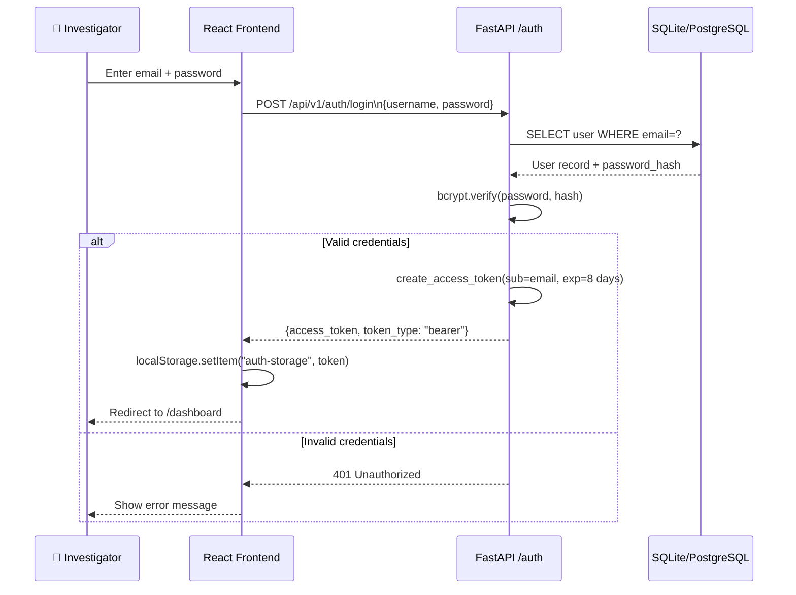

### 7.2 Evidence Acquisition Pipeline (URL Submission)

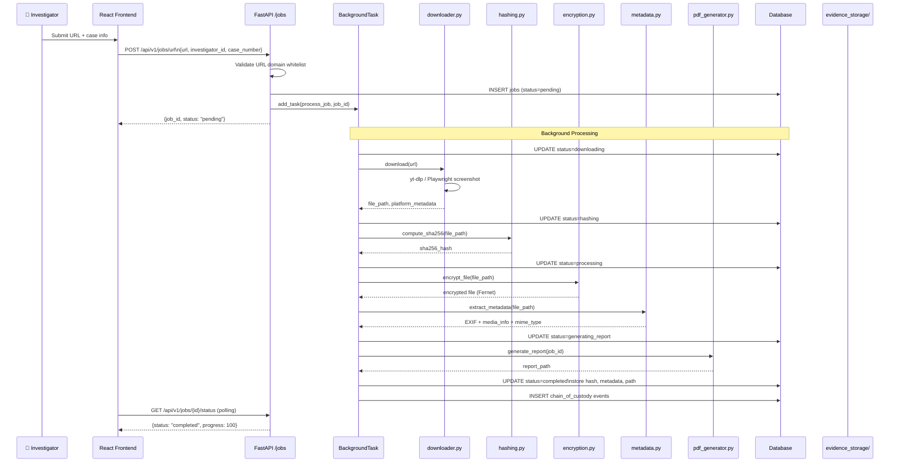

### 7.3 Network Scan + CVE Mapping Flow

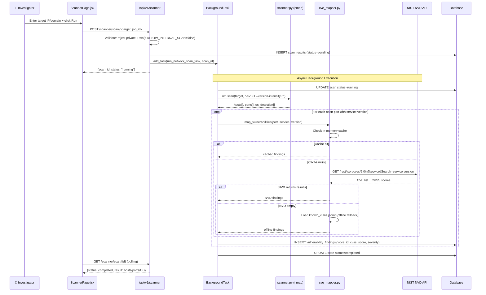

### 7.4 Correlation Analysis Flow

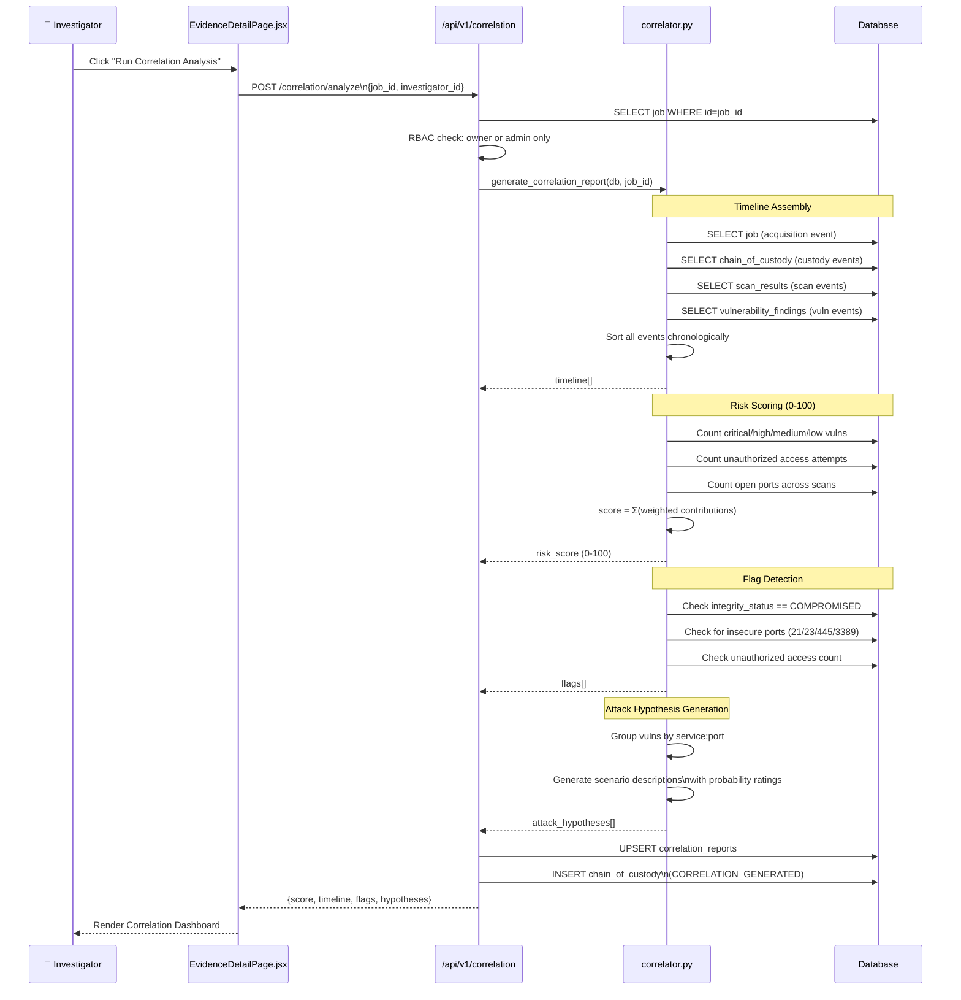

### 7.5 Red Team Recon Flow (DNS Example)

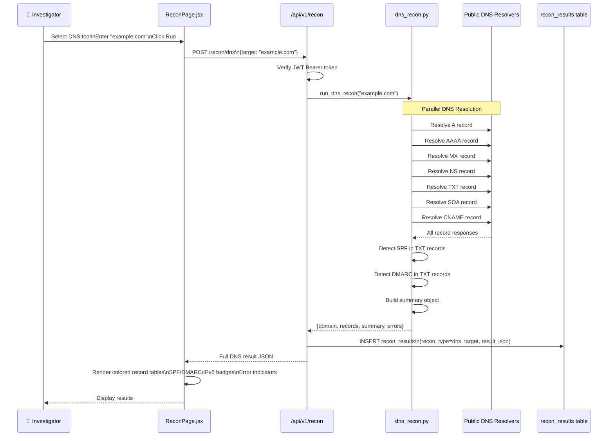

### 7.6 Threat Intelligence IoC Lookup Flow

```mermaid
sequenceDiagram
    participant U as Investigator
    participant FE as Frontend
    participant API as Backend
    participant SVC as ThreatIntel
    participant OFF as OfflineDB
    participant ABDB as AbuseIPDB
    participant VT as VirusTotal
    participant DB as Database

    U->>FE: Enter IoC and click Run
    FE->>API: Submit IoC for lookup
    API->>SVC: Start threat intel check
    SVC->>SVC: Detect IoC type IP or domain or hash
    Note over SVC,OFF: Offline check runs without any API key
    SVC->>OFF: Check known malicious IPs list
    OFF-->>SVC: Match found Shodan scanner
    SVC->>SVC: Set risk score to 85
    Note over SVC,ABDB: Step runs only if AbuseIPDB key is set
    SVC->>ABDB: Query IP reputation
    ABDB-->>SVC: Confidence score and report count returned
    SVC->>SVC: Update score if AbuseIPDB result is higher
    Note over SVC,VT: Step runs only if VirusTotal key is set
    SVC->>VT: Query IP file analysis
    VT-->>SVC: Malicious and suspicious engine counts returned
    SVC->>SVC: Update score if VirusTotal result is higher
    SVC->>SVC: Assign verdict based on final score
    SVC-->>API: Verdict Malicious with score 85
    API->>DB: Save recon result to database
    API-->>FE: Return JSON response
    FE->>FE: Render verdict banner and risk gauge
    FE-->>U: Show verdict Malicious Shodan scanner
```

---

## 8. Data Flow Diagrams

### 8.1 Evidence Encryption & Integrity

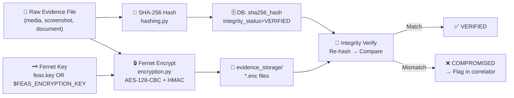

### 8.2 CVE Mapping Decision Tree

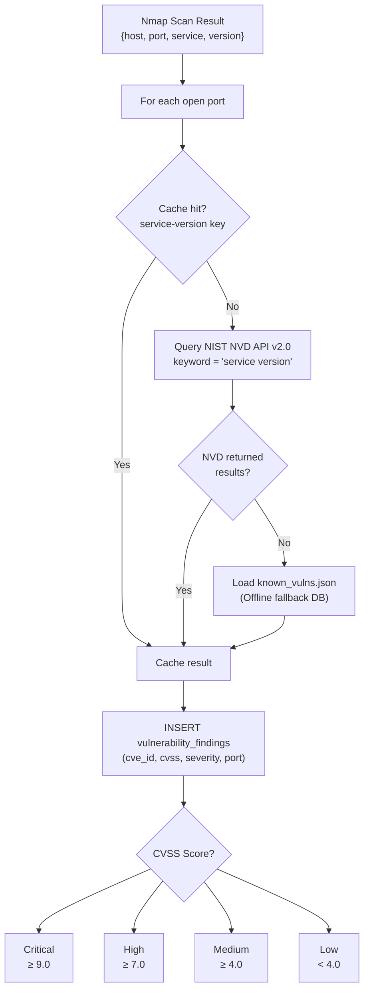

### 8.3 Risk Score Computation

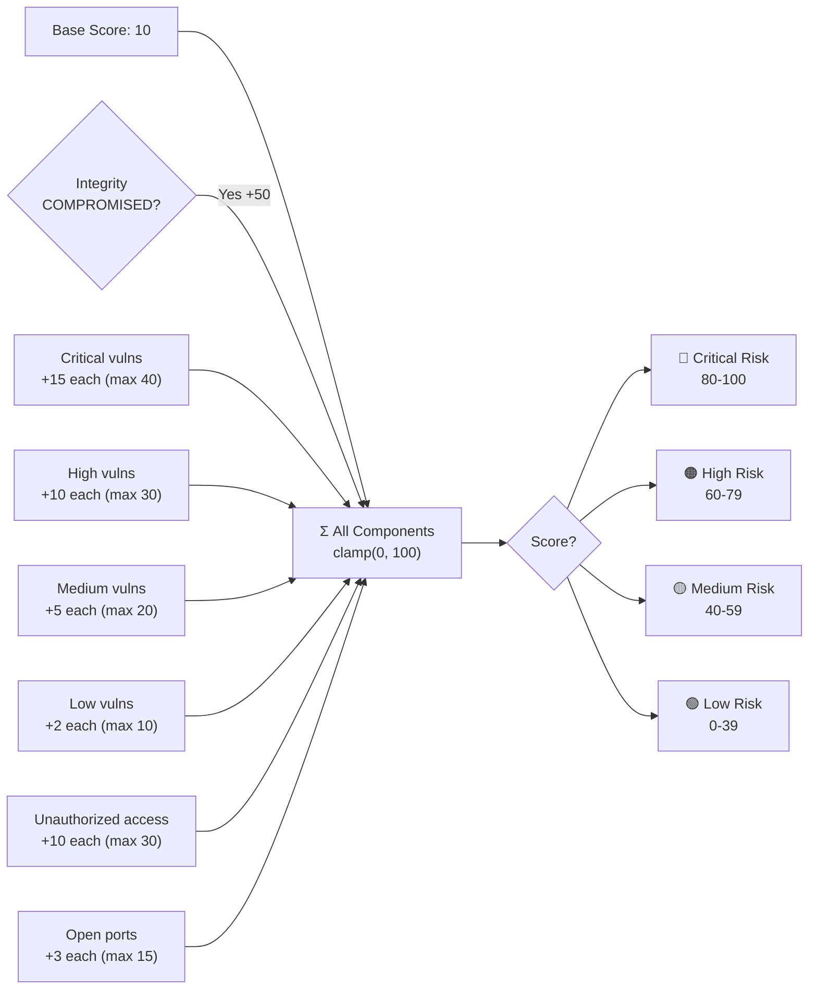

---

## 9. Security Features

### 9.1 Authentication & Authorization

| Feature | Implementation |
|---|---|
| **Password hashing** | `passlib[bcrypt]` with bcrypt rounds |
| **JWT tokens** | `python-jose` · HS256 · 8-day expiry |
| **RBAC** | `is_admin` flag · owner-only endpoints on jobs/correlation |
| **Unauthorized access logging** | Auto-logged to chain_of_custody as `UNAUTHORIZED_ACCESS_ATTEMPT` |
| **Token extraction** | Bearer token via `Authorization` header |

### 9.2 Evidence Security

| Feature | Implementation |
|---|---|
| **Encryption at rest** | Fernet (AES-128-CBC + HMAC-SHA256) via `cryptography.fernet` |
| **Integrity verification** | SHA-256 re-hash on demand → compare to stored hash |
| **Audit trail** | Append-only `chain_of_custody` table — DB-level delete/update blocked |
| **Tamper detection** | `integrity_status` field → `COMPROMISED` triggers correlation flag |

### 9.3 API Security

| Feature | Implementation |
|---|---|
| **CORS** | `CORSMiddleware` — configurable origin whitelist |
| **Input validation** | Pydantic v2 schemas on all request bodies |
| **URL domain whitelist** | Validator on `URLJobCreate` — only allowed platforms |
| **MIME type whitelist** | `validator.py` — blocks non-media MIME types on upload |
| **File size limit** | 500MB max per upload |
| **Private IP blocking** | `scanner.py` `is_private_target()` — blocks RFC1918 unless `ALLOW_INTERNAL_SCAN=true` |
| **Rate limiting** | NVD API: 6s inter-request delay (5 req/30s compliance) |

---

## 10. File Inventory & LOC

### Backend (`backend/`)

| File | Lines | Purpose |
|---|---|---|
| `app/main.py` | 93 | FastAPI app factory, lifespan, router registration |
| `app/core/config.py` | 115 | Pydantic settings — 24 env-configurable params |
| `app/models/sql_models.py` | 151 | 9 SQLAlchemy ORM table classes |
| `app/models/schemas.py` | 157 | 12 Pydantic request/response schemas |
| `app/db/session.py` | ~30 | SQLAlchemy engine + SessionLocal factory |
| `app/db/init_db.py` | ~60 | Table creation + default admin seeding |
| `app/db/base.py` | ~10 | Declarative base |
| **API Endpoints** | | |
| `app/api/v1/endpoints/auth.py` | 165 | Login / Register / Me / Logout |
| `app/api/v1/endpoints/jobs.py` | 565 | Full evidence pipeline + PDF download |
| `app/api/v1/endpoints/scanner.py` | 136 | Scan trigger + status + vuln queries |
| `app/api/v1/endpoints/correlation.py` | 122 | Correlation trigger + retrieval + RBAC |
| `app/api/v1/endpoints/recon.py` | 195 | 7 recon endpoints + history ⭐ New |
| `app/api/v1/endpoints/dashboard.py` | 48 | Stats aggregation |
| `app/api/v1/endpoints/health.py` | 25 | Health check |
| `app/api/v1/endpoints/profile.py` | 52 | User profile CRUD |
| `app/api/v1/endpoints/links.py` | 31 | Social link CRUD |
| `app/api/v1/endpoints/social.py` | 29 | Social media metadata |
| **Services** | | |
| `app/services/downloader.py` | 345 | yt-dlp + Playwright content acquisition |
| `app/services/encryption.py` | 75 | Fernet key mgmt + file encrypt/decrypt |
| `app/services/hashing.py` | 70 | SHA-256 compute + verify |
| `app/services/metadata.py` | 153 | EXIF + FFmpeg + python-magic |
| `app/services/storage.py` | 58 | Local + S3 storage abstraction |
| `app/services/chain_of_custody.py` | 129 | Audit trail writer |
| `app/services/validator.py` | 141 | MIME + size + domain validation |
| `app/services/pdf_generator.py` | ~1370 | ReportLab forensic PDF generator |
| `app/services/pdf_service.py` | 57 | PDF service orchestrator |
| `app/services/report_builder.py` | 96 | Report section builder |
| `app/services/scanner.py` | 104 | Nmap wrapper + result parser |
| `app/services/cve_mapper.py` | 206 | NVD API + offline CVE mapping |
| `app/services/correlator.py` | 326 | Timeline + risk score + hypotheses |
| `app/services/dns_recon.py` | 82 | DNS record lookup ⭐ New |
| `app/services/whois_lookup.py` | 102 | WHOIS lookup + age calc ⭐ New |
| `app/services/subdomain_enum.py` | 107 | Concurrent subdomain brute-force ⭐ New |
| `app/services/http_headers.py` | 158 | HTTP security header analysis ⭐ New |
| `app/services/ssl_inspector.py` | 165 | TLS cert + cipher inspector ⭐ New |
| `app/services/geoip.py` | 91 | GeoIP + ASN lookup ⭐ New |
| `app/services/threat_intel.py` | 198 | Threat intel IoC lookup ⭐ New |
| **Workers** | | |
| `app/workers/celery_app.py` | ~25 | Celery configuration |
| `app/workers/scan_tasks.py` | ~80 | Async nmap task wrapper |
| **Tests** | | |
| `tests/test_scanner.py` | ~80 | Scanner + private IP tests |
| `tests/test_cve_mapper.py` | ~70 | CVE mapper + fallback tests |
| `tests/test_correlator.py` | ~85 | Timeline + risk score tests |
| `tests/test_encryption.py` | ~55 | Fernet encrypt/decrypt tests |
| `tests/test_report_builder.py` | ~45 | Report generation tests |

**Backend Total: ~6,200 LOC** across 42 files

### Frontend (`frontend/src/`)

| File | Lines | Purpose |
|---|---|---|
| `App.jsx` | 87 | Root — ThemeProvider + Router + 15 routes |
| `index.js` | 25 | ReactDOM.render entry point |
| `index.css` | 22 | CSS reset |
| `pages/Dashboard.jsx` | 329 | Stats cards + recent jobs table |
| `pages/EvidenceDetailPage.jsx` | 735 | Evidence viewer + Correlation tab + PDF export |
| `pages/ScannerPage.jsx` | 701 | Nmap console + host/port tree + CVE table |
| `pages/VulnerabilitiesPage.jsx` | 320 | CVE findings table with severity filters |
| `pages/ReconPage.jsx` | 620 | 7-tool Red Team recon UI ⭐ New |
| `pages/AnalyticsPage.jsx` | 183 | Timeline charts + stats |
| `pages/DocsPage.jsx` | 511 | Built-in API documentation |
| `pages/HelpPage.jsx` | 254 | Help + FAQ |
| `pages/ProfilePage.jsx` | 221 | User profile form |
| `pages/SettingsPage.jsx` | 320 | App settings |
| `pages/LoginPage.jsx` | 131 | Login form |
| `pages/RegisterPage.jsx` | 190 | Registration form |
| `pages/SubmissionPage.jsx` | 128 | URL + file upload forms |
| `pages/JobMonitorPage.jsx` | 40 | Job monitor (uses common components) |
| `pages/PlaceholderPage.jsx` | 20 | Generic placeholder |
| `services/api.js` | 152 | Axios API client + 3 service groups |
| `store/authStore.js` | ~30 | Zustand auth state |
| `store/themeStore.js` | ~20 | Zustand theme state |
| `styles/GlobalStyles.jsx` | ~50 | CSS-in-JS global styles |
| `styles/theme.js` | ~80 | 3 themes: cyber / dark / light |
| `components/layout/Sidebar.jsx` | 258 | Navigation sidebar (Red Team section ⭐) |
| `components/layout/Header.jsx` | 135 | Top header bar |
| `components/layout/Layout.jsx` | 40 | Layout wrapper |
| `components/layout/Footer.jsx` | 80 | Footer |
| `components/common/ProtectedRoute.jsx` | ~25 | Auth-gated route wrapper |
| `components/evidence/*` | ~200 | Evidence card components |
| `components/monitoring/*` | ~100 | Job status components |
| `components/submission/*` | ~150 | Upload form components |

**Frontend Total: ~5,200 LOC** across 35 files

### Grand Total: **~11,400 LOC** across **77 files**

---

## 11. Test Results

### Unit Test Suite — 16/16 PASS ✅

| Test File | Tests | Status |
|---|---|---|
| `test_scanner.py` | Scanner logic, private IP blocking, nmap result parsing | ✅ Pass |
| `test_cve_mapper.py` | NVD API mock, offline fallback, CVSS mapping | ✅ Pass |
| `test_correlator.py` | Timeline builder, risk scoring, flag detection | ✅ Pass |
| `test_encryption.py` | Fernet key generation, encrypt/decrypt, wrong-key rejection | ✅ Pass |
| `test_report_builder.py` | PDF section generation, field mapping | ✅ Pass |

### Live Endpoint Verification ✅

| Endpoint | Target | Result |
|---|---|---|
| `GET /health` | localhost:8000 | `{"status": "ok"}` |
| `POST /auth/login` | admin@feas.local | JWT token issued |
| `POST /recon/dns` | google.com | 16 DNS records, SPF ✓, DMARC ✓ |
| `POST /recon/whois` | google.com | Registrar: MarkMonitor, age: 10,483 days |
| `POST /recon/subdomains` | google.com | **56 subdomains** in **1.24 seconds** |
| `POST /recon/headers` | google.com | Grade: F, Server: gws disclosed |
| `POST /recon/ssl` | google.com:443 | TLSv1.3, 0 issues, 62 days remaining |
| `GET /recon/geoip/8.8.8.8` | 8.8.8.8 | US / Ashburn / Google LLC / AS15169 |
| `POST /recon/threat-intel` | 80.82.77.33 | **Malicious** / Score 85 — Shodan scanner |
| `GET /recon/history` | — | 7 records persisted correctly |
| Frontend compile | localhost:3000 | ✅ Compiled with 0 errors |

---

## 12. Red Team Recon Module

### Module Overview

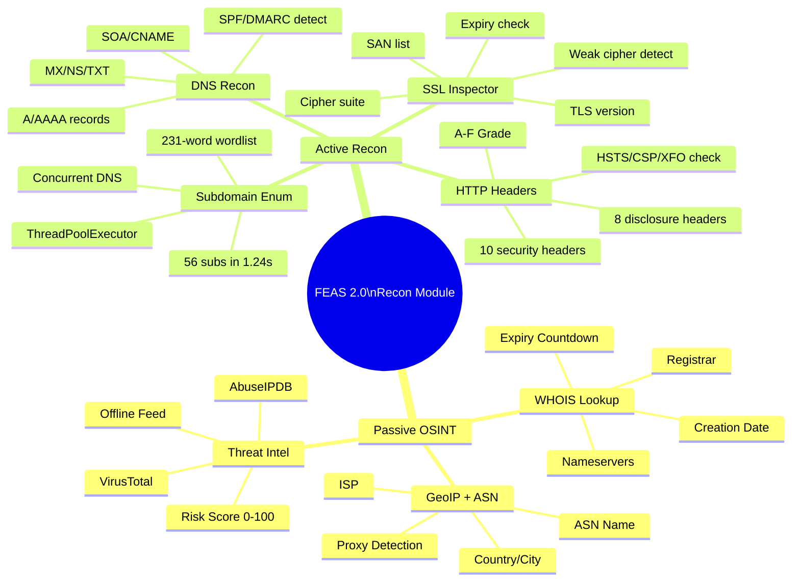

### IoC Detection Capability

| IoC Type | Offline Feed | AbuseIPDB | VirusTotal |
|---|---|---|---|
| IP Address | ✅ | ✅ (with key) | ✅ (with key) |
| Domain | ✅ (suspicious TLD) | ✗ | ✅ (with key) |
| MD5 Hash | ✗ | ✗ | ✅ (with key) |
| SHA1 Hash | ✗ | ✗ | ✅ (with key) |
| SHA256 Hash | ✗ | ✗ | ✅ (with key) |

### HTTP Security Grading

| Grade | Criteria |
|---|---|
| **A** | All headers present, no missing high/medium |
| **B** | 1 missing Low header or 3+ missing Low |
| **C** | 1 missing High OR 2+ missing Medium |
| **D** | 1 missing High + 1 missing Medium |
| **F** | 2+ missing High severity headers |

> Note: google.com scores **F** because it lacks `Content-Security-Policy` and `Strict-Transport-Security` response headers from its CDN edge nodes.

---

## 13. Deployment

### Quick Start

```bash
# 1. Clone and setup backend
cd backend
python3 -m venv venv && source venv/bin/activate
pip install -r requirements.txt

# 2. Start backend (SQLite mode, no Redis needed)
USE_SQLITE=true USE_CELERY=false ALLOW_INTERNAL_SCAN=true \
  uvicorn app.main:app --host 0.0.0.0 --port 8000

# 3. Start frontend
cd ../frontend
npm install && npm start
# → http://localhost:3000

# Default admin credentials:
# Email: admin@feas.local
# Password: admin123
```

### Environment Variables

| Variable | Default | Description |
|---|---|---|
| `USE_SQLITE` | `false` | Use SQLite instead of PostgreSQL |
| `USE_CELERY` | `true` | Use Celery; `false` → FastAPI BackgroundTasks |
| `ALLOW_INTERNAL_SCAN` | `false` | Allow scanning private/localhost IPs |
| `FEAS_ENCRYPTION_KEY` | auto-generated | Fernet key for file encryption |
| `NVD_API_KEY` | none | NIST NVD API key (removes rate limiting) |
| `ABUSEIPDB_API_KEY` | none | AbuseIPDB key for IoC checks |
| `VT_API_KEY` | none | VirusTotal API key for IoC checks |
| `DEFAULT_ADMIN_EMAIL` | `admin@feas.local` | Bootstrap admin email |
| `DEFAULT_ADMIN_PASSWORD` | `admin123` | Bootstrap admin password |

### Technology Stack Summary

| Layer | Technology | Version |
|---|---|---|
| Backend Framework | FastAPI | 0.115.0 |
| ASGI Server | uvicorn | 0.30.0 |
| ORM | SQLAlchemy | 2.0.23 |
| Database (dev) | SQLite | built-in |
| Database (prod) | PostgreSQL | 15+ |
| Task Queue | Celery | 5.3.6 |
| Message Broker | Redis | 5.0.1 |
| Auth | python-jose + passlib | 3.3.0 / 1.7.4 |
| Encryption | cryptography (Fernet) | 42.0.5 |
| HTTP Client | httpx | 0.27.0 |
| DNS | dnspython | 2.6.1 ⭐ New |
| WHOIS | python-whois | 0.9.4 ⭐ New |
| Network Scanning | python-nmap | 0.7.1 |
| PDF Reports | ReportLab | 4.0.7 |
| Media Download | yt-dlp | 2023.11.16 |
| Browser Automation | Playwright | 1.40.0 |
| Frontend Framework | React | 18.x |
| State Management | Zustand | — |
| Data Fetching | React Query | — |
| Styling | Styled-Components | — |
| Icons | react-icons | — |

---

*Report generated by FEAS 2.0 · Forensic Evidence Acquisition System*
*University 6th Semester Penetration Testing Project*
